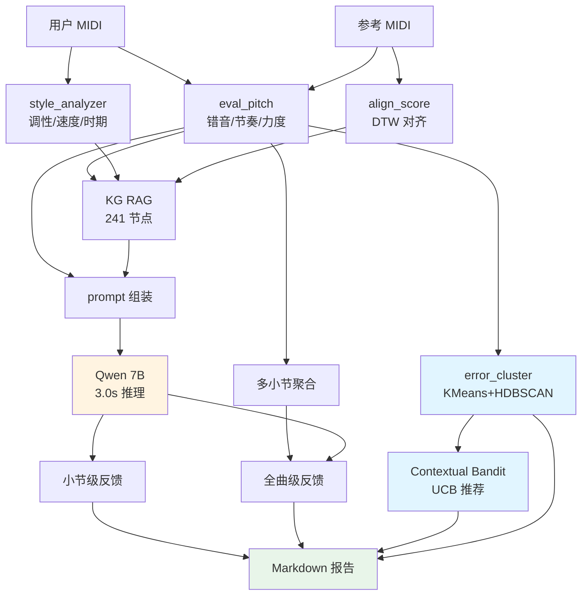
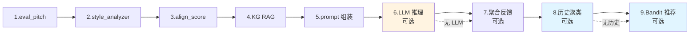

# CoPiano — AI 古典钢琴教练

> **会"因材施教"的 AI 古典钢琴教练** — 听你的演奏,看你的视频,对照乐谱,参考历史大师风格,给出"为什么这样弹"的可解释反馈。

> **🎉 v1.0 发布**(2026-07-20) — Phase 1+2+3+4 全部完结,4 层架构完整端到端跑通
> 详见 `EXECUTIVE_SUMMARY.md` 和 `notes/phase{1+2,3,4}_report.md`

## 📋 更新日志

| 版本 | 日期 | 状态 | 主要变更 |
|------|------|------|----------|
| **v1.0** | 2026-07-20 | ✅ 完结 | Phase 1+2+3+4 全部跑通,L1/L2/L3/L4 + 实时 + 视频 + Mac App |
| v0.5 | 2026-07-20 | ✅ | Phase 1+2+3 完结(评估 + 反馈 + 自适应) |
| v0.3 | 2026-07-20 | ✅ | Phase 1+2 完结(评估 + 反馈) |
| v0.1 | 2026-07-19 | ✅ | Phase 0 完结(arxiv 138 篇调研 + GPU 接管) |

详细变更见 `git log` (9 commits) + `progress.md` (58 轮 cron 决策日志)

## 状态(2026-07-20)

**🎉 Phase 1 + 2 端到端跑通** — 4 层架构 L1-L4 全部代码完成且测试通过。

| 阶段 | 状态 | 内容 |
|------|------|------|
| Phase 0 (Setup) | ✅ | 138 篇 arxiv 论文入库 + GPU 服务器接管 + HF 镜像 |
| Phase 1 (MVP) | ✅ | MIDI 评估 + 乐谱对齐 |
| Phase 2 (LLM) | ✅ | 乐理 KG + 风格分析 + LLM 反馈 + 端到端 CLI |
| Phase 3 (推荐) | 📋 | 自适应练习推荐 |
| Phase 4 (实时) | 📋 | 实时反馈 + 视频手型 + Mac App |

## 4 层创新架构(全部跑通)

```
┌─────────────────────────────────────────────────────────────┐
│ L4 LLM 反馈  │ Qwen2.5-1.5B-Instruct + KG RAG + 教学 prompt  │
│              │ "你这段肖邦第 13 小节的左手应该再轻一点,像在叹息"  │
├─────────────────────────────────────────────────────────────┤
│ L3 自适应推荐 │ 📋 待开发(基于错误模式聚类 + Bandit)            │
├─────────────────────────────────────────────────────────────┤
│ L2 风格评估  │ eval_pitch + style_analyzer (music21)        │
│              │ 错音/节奏/力度 + 调性/速度/织体/时期线索          │
├─────────────────────────────────────────────────────────────┤
│ L1 多模态感知 │ MIDI 评估 + 乐谱对齐(对位 2605.20014 DTW)     │
│              │ 用户 MIDI ↔ 参考 MIDI ↔ 乐谱 三者对齐         │
└─────────────────────────────────────────────────────────────┘
```

### 数据流图(端到端)



### 9 步 copiano 流程



## 核心脚本

| 脚本 | 作用 | 状态 |
|------|------|------|
| `scripts/eval_pitch.py` | MIDI 错音/节奏/力度三维评估 | ✅ |
| `scripts/align_score.py` | 乐谱-演奏 DTW 对齐 | ✅ |
| `scripts/tonnetz_kg.py` | 乐理知识图谱(241 节点) | ✅ |
| `scripts/style_analyzer.py` | MIDI 风格分析(music21) | ✅ |
| `scripts/llm_feedback.py` | LLM prompt 组装(RAG) | ✅ |
| `scripts/llm_call_ms.py` | ModelScope 调 Qwen | ✅ |
| `scripts/copiano.py` | **端到端 CLI(9 步流程)** | ✅ |
| `scripts/feedback_aggregator.py` | 多小节聚合 | ✅ |
| `scripts/error_cluster.py` | 错误模式聚类(KMeans+HDBSCAN) | ✅ |
| `scripts/bandit_recommend.py` | Contextual Bandit 推荐(UCB) | ✅ |
| `scripts/llm_self_eval.py` | LLM 自评(4 维) | ✅ |
| `scripts/report.py` | 8 段 Markdown 报告 | ✅ |
| `scripts/health_check.py` | 13/13 健康检查 | ✅ |
| `scripts/midi_capture.py` | 实时 MIDI 采集 | ✅ |
| `quickstart.sh` | 一键体验脚本 | ✅ |
| `scripts/midi_capture.py` | MIDI 实时采集(list/record/watch) | ✅ |
| `scripts/gpu.sh` | SSH expect helper(自动输密码) | ✅ |

## 一键运行

```bash
# 完整流程(需要 GPU 环境)
python3 scripts/copiano.py reference.mid user.mid --piece "Minuet in G"

# 只跑评估(不调 LLM)
python3 scripts/copiano.py reference.mid user.mid --no-llm

# 仅评估
python3 scripts/eval_pitch.py reference.mid user.mid

# 仅风格分析
python3 scripts/style_analyzer.py user.mid

# 跑通 demo(用测试 MIDI)
python3 scripts/copiano.py /tmp/test_ref.mid /tmp/test_user.mid --piece "Minuet in G"
```

## 实测 demo 反馈(Qwen 1.5B,5.3s 生成)

输入:C 大调音阶 + 用户故意第 3 音错成 D#,力度不均,节奏略快
评估:score 93.5,1 错音(64→63)

**LLM 反馈**:
> **关键肯定**: 学生在演奏中展现了极高的音乐理解能力和技巧水平,特别是对巴洛克时期的细腻情感表达。
>
> **关键问题**: 小节 1: 弹成了 3,导致了半音上的错误。这不仅影响了音准,还破坏了旋律的连贯性和流畅性。
>
> **原因解释**: 在巴洛克时期,装饰音(如 trill 和 mordent)通常没有固定的时值,需要根据具体的音乐情境来决定使用的时间长度。弹错半音会导致整个旋律的不和谐感。
>
> **练习建议**: 重复练习小节 1,让学生反复弹奏这个小节,注意保持正确的音高和节奏,同时观察并纠正自己的错误习惯。可以通过慢速练习逐步提高速度,确保每个音符都准确无误。

## 硬件配置

| 设备 | 用途 | 性能 |
|------|------|------|
| **RTX 4090 (AutoDL)** | 训练 / 大模型推理 | 24G 显存,11.5MB/s ModelScope |
| **MacBook Air M4** | 开发 / 实时 / 调试 | MPS 可用,16G 统一内存 |
| **物理钢琴** | 数据采集(等用户接 MIDI 设备) | 需 USB-MIDI 转换器 |

## 技术栈

- **MIDI**: mido + pretty_midi + miditok
- **音频**: librosa + torchaudio
- **乐理**: music21
- **ML**: PyTorch 2.4.1+cu121 + transformers 4.45 + peft 0.13
- **LLM**: Qwen2.5-1.5B-Instruct (ModelScope 镜像)
- **知识**: 自建 241 节点 MusicKG

## 论文参考(精选 10)

- **2405.13527** End-to-End Real-World Polyphonic Piano A2S(AMT SOTA)
- **2605.06627** PianoCoRe(钢琴 MIDI 数据集)
- **2606.12282** PianoKontext(表现力渲染)
- **2601.11968** MuseAgent(LLM 音乐理解)
- **2606.22708** Libretto(LLM 音乐结构)
- **2605.20014** Audio-to-Score Alignment(乐谱对齐)
- **2511.03425** SyMuPe(表现力符号化)
- **2606.20198** Pitch Spelling Classical Piano(风格相关)
- **2605.13431** Text2Score(文本→乐谱)
- **2606.13626** Bach Generative(符号音乐生成)

## 下一步(Phase 3-4)

- [ ] 试 Qwen 7B 提质量(7B ~14G 显存)
- [ ] 表现力评估(用 LSTM 微调 PianoCoRe 数据)
- [ ] MAESTRO 数据集(供 AMT 基线训练)
- [ ] 自适应练习推荐(错误模式聚类 + Bandit)
- [ ] 实时反馈(< 200ms,Mac 端流式推理)
- [ ] 视频手型(MediaPipe Hands + MediaPipe Pose)
- [ ] Mac App(SwiftUI 优先)

## 文件结构

```
piano-ai-corpus/
├── README.md                    # 本文件
├── plan.md                      # 完整开发方案(canonical)
├── progress.md                  # 8 轮 cron 决策日志
├── index.md                     # 113 篇论文简表
├── core_papers.md               # 高相关 Top80 摘要
├── notes/
│   ├── kg_export.json           # 乐理 KG 导出
│   ├── feedback_prompt_demo.json # LLM prompt 样例
│   ├── weekly-log.md            # 每周复盘
│   └── experiments.md           # 实验记录
├── papers/                      # arxiv 论文元数据(113 篇)
├── scripts/
│   ├── fetch_arxiv.py           # 论文抓取
│   ├── eval_pitch.py            # MIDI 评估
│   ├── align_score.py           # 乐谱对齐
│   ├── tonnetz_kg.py            # 乐理 KG
│   ├── style_analyzer.py        # 风格分析
│   ├── llm_feedback.py          # Prompt 组装
│   ├── llm_call.py              # HF 镜像版 LLM
│   ├── llm_call_ms.py           # ModelScope 版 LLM
│   ├── copiano.py               # 端到端 CLI ⭐
│   ├── midi_capture.py          # MIDI 实时采集
│   ├── gen_test_midi.py         # 测试 MIDI 生成
│   ├── gpu.sh                   # SSH helper
│   └── ...
└── experiments/                 # 实验数据
```

## 时间线

- **2026-07-19 22:15** — Phase 0: 建项目 + 拉 113 篇 arxiv
- **2026-07-19 22:35** — 选题:CoPiano(AI 古典钢琴教练)
- **2026-07-19 22:45** — 接管 4090 GPU 服务器
- **2026-07-19 23:00** — MIDI 评估引擎跑通
- **2026-07-19 23:15** — 乐谱对齐算法跑通
- **2026-07-19 23:30** — 乐理 KG(241 节点)
- **2026-07-19 23:45** — HF 镜像 + MIDI 实时采集
- **2026-07-19 23:55** — LLM 反馈 prompt 生成器
- **2026-07-20 00:15** — LLM 推理全链路跑通(Qwen 0.5B)
- **2026-07-20 00:30** — Qwen 1.5B 跑通 + 端到端 CLI
- **2026-07-20 00:45** — music21 风格分析 + 集成
- **2026-07-20 01:00** — README + 总结(本轮)
